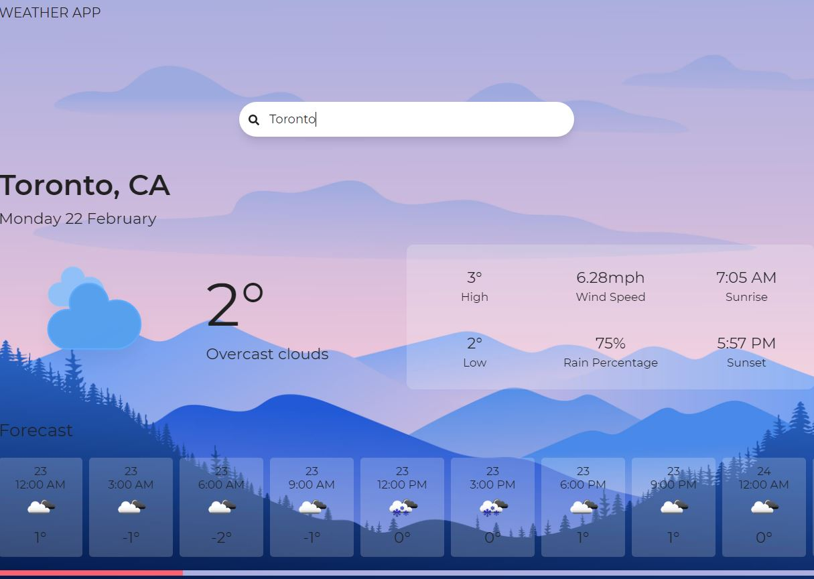

# React - weather-app
A Weather App using OpenWeatherMap API

**Website**: http://weather.mdmazo.com/

## How to Use
1. Load the website and a Search Form element will be shown.
2. Search for the designated area/city you want to check the weather
3. The weather app will generate the weather for the location including the forecast for the next 2 days.

